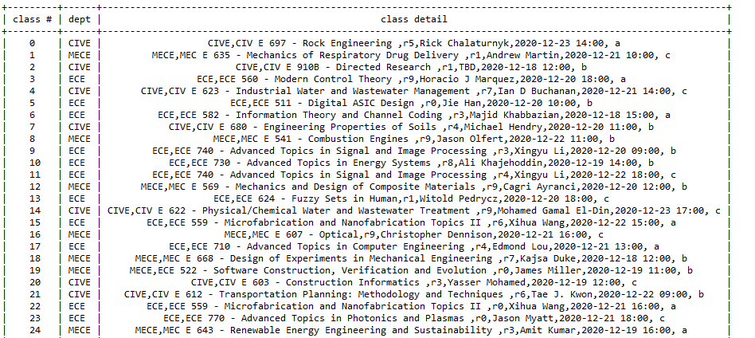

# University Class Scheduling Using Genetic Algorithm  

A case study for the University of Alberta (Fall 2020) :nerd_face:

## Visitors to the repository

## The resulting TimeTable

### Special Thanks to [MuriRokcs](https://github.com/MuriRokcs) :smiling_face_with_three_hearts: who helped out with the web scrapper !
